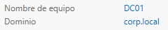
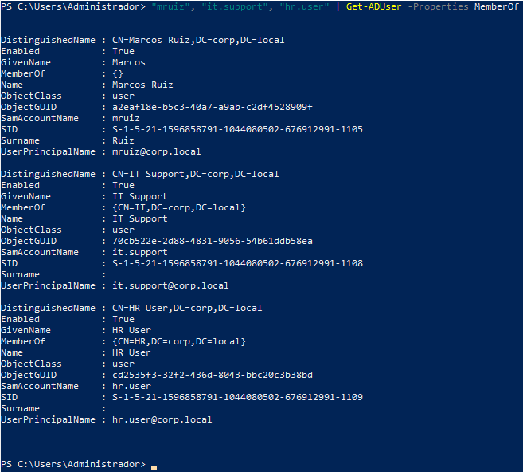
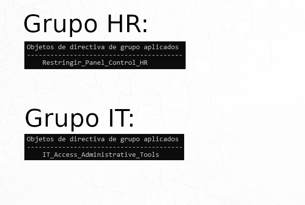

# Active Directory Lab


A virtualized Active Directory lab environment built with Windows Server and VirtualBox.

This project simulates a basic corporate infrastructure focused on:

- Active Directory Domain Services (AD DS)
- DNS configuration
- User and group administration
- Organizational Units (OU)
- Group Policy Objects (GPO)
- Domain-joined Windows clients

---

# Lab Architecture

```text
[ CLIENT01 ]
Windows 10 Client
        |
        |
[ DC01 ]
Windows Server 2022
AD DS | DNS | GPO
```

---

# Technologies Used

- Windows Server 2022
- Windows 10
- VirtualBox
- Active Directory Domain Services (AD DS)
- DNS
- Group Policy Management

---

# Features Implemented

- Domain Controller deployment
- Domain creation (`corp.local`)
- DNS configuration
- User and security group management
- Organizational Units (OU)
- Group Policy Objects (GPO)
- Domain client integration
- Domain authentication testing

---

# Security Groups

| Group | Scope | Type |
|---|---|---|
| IT | Global | Security |
| HR | Global | Security |

---

# Group Policies

## HR
- Control Panel access disabled

## IT
- Administrative access policies enabled

---

# Screenshots

## Domain Controller



---

## Active Directory Users and Computers



---

## Group Policy Configuration



---

## Domain-Joined Client


---

# Project Structure

```text
active-directory-lab/
│
├── README.md
├── docs/
│   └── lab-setup.md
│
└── screenshots/
    ├── domain-controller.png
    ├── active-directory-users.png
    ├── group-policy.png
    └── joined-client.png
```

---

# Documentation

Detailed lab configuration documentation is available here:

```text
docs/lab-setup.md
```

---

# Skills Practiced

- Windows Server administration
- Active Directory management
- GPO deployment
- DNS configuration
- Domain administration
- Virtualized infrastructure management

---

# Purpose of the Project

This lab was created to strengthen practical skills related to enterprise Windows environments and system administration workflows commonly found in corporate IT infrastructures.
